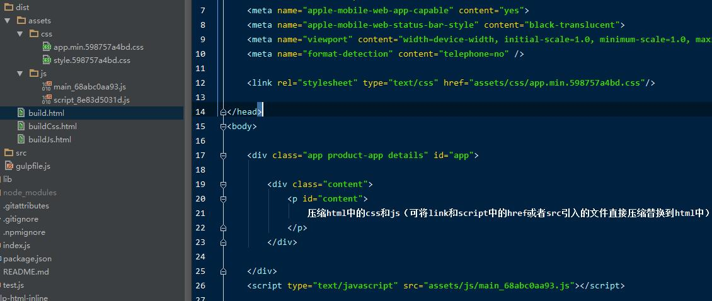

# gulp-html-builder

[![NPM version][npm-image]][npm-url]
[![Downloads][downloads-image]][downloads-url]


[npm-image]: https://img.shields.io/npm/v/gulp-html-builder.svg?style=flat-square
[npm-url]: https://npmjs.org/package/gulp-html-builder
[downloads-image]: http://img.shields.io/npm/dm/gulp-html-builder.svg?style=flat-square
[downloads-url]: https://npmjs.org/package/gulp-html-builder

combo and merge `css` and `js` to html. no matter the file is online or not.
对页面中引入的css文件和js文件进行合并并压缩到新文件

## Features

+ 根据 builder 注释进行合并压缩
+ 自由控制新文件路径和html中引入新文件路径

## Usage

```javascript
var gulp = require('gulp');
var htmlBuilder = require('gulp-html-builder');

gulp.src('src/buildJs.html')
    .pipe(htmlBuilder({
        jsDir: 'dist/assets/js',
        filterPath: 'dist/'
    }))
    .pipe(gulp.dest('dist'));

});
```

## Html
```html

    <!-- builder: app.min{{ .$hash }}.css -->
    <link rel="stylesheet" href="assets/css/a.css"/>
    <link rel="stylesheet" href="assets/css/b.css" ignore/>
    <!-- builder end -->

```
```html
    <!-- builder: main{{ _$hash }}.js -->
    <script src="assets/js/a.js"></script>
    <script src="assets/js/b.js"></script>
    <script src="assets/js/c.js"></script>
    <!-- builder end -->
```

##output


## Options
```javascript

gulp.task('build.html', function(){

    gulp.src('src/build.html')
        .pipe(htmlBuilder({
            //编译合成后的根目录
            baseDir: 'dist',
            //css文件编译合成后的存放目录，base存在则相对于base：  'dist/assets/css'
            cssDir: 'assets/css',
            //js文件编译合成后的存放目录，base存在则相对于base：  'dist/assets/js'
            jsDir: 'assets/js',
            //为了在html页面中能正确引入对应合成后的文件，
            //需要对合成后写入的路径进行过滤，
            //filterPath就是过滤目录的，让合成后的文件相对于编译后的html目录查找
            filterPath: 'dist/'
        }))
        .pipe(gulp.dest('dist'));

});

//gulp.task('default', ['build.html']);

```

#License
ISC
